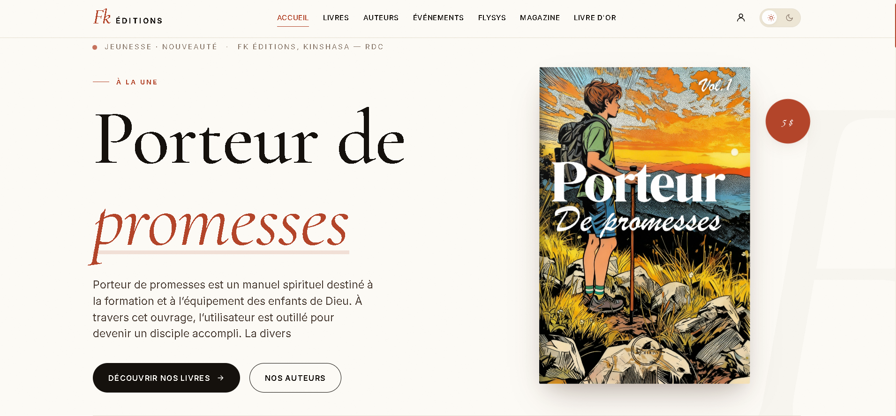
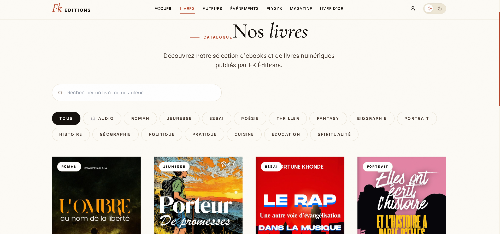
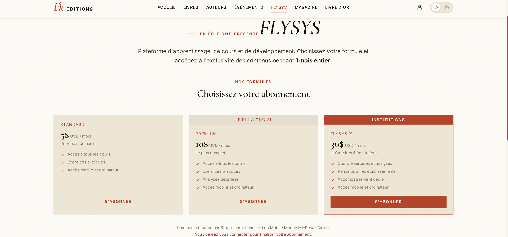
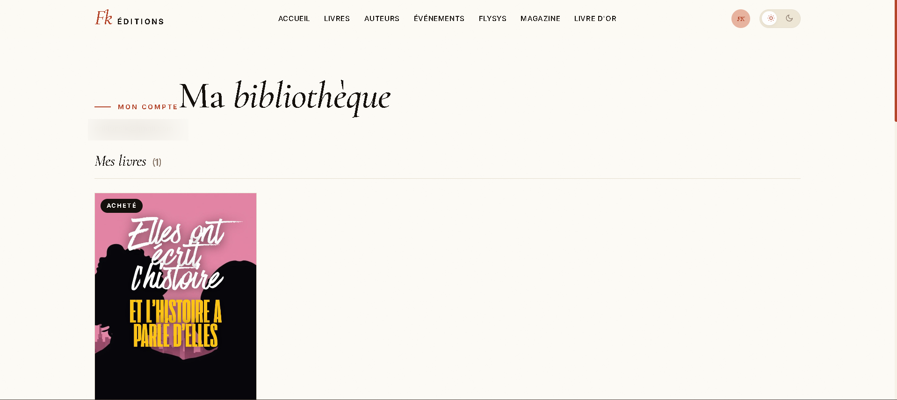
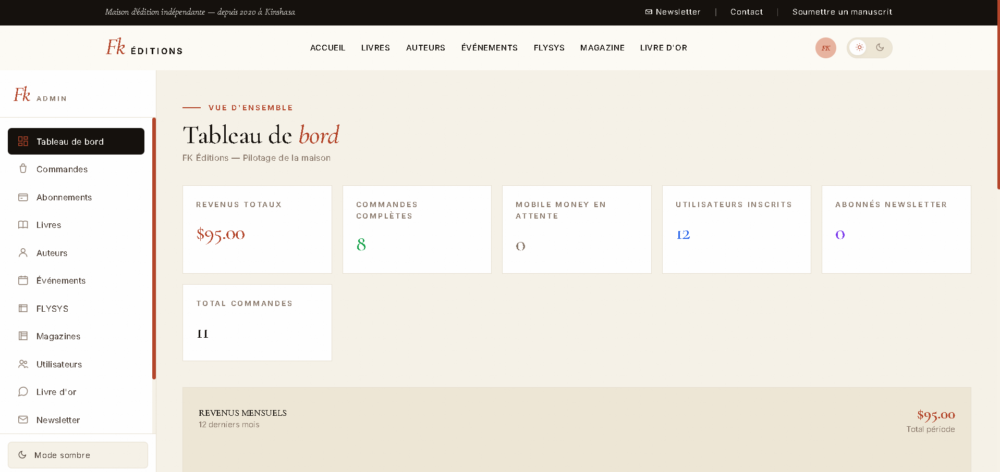
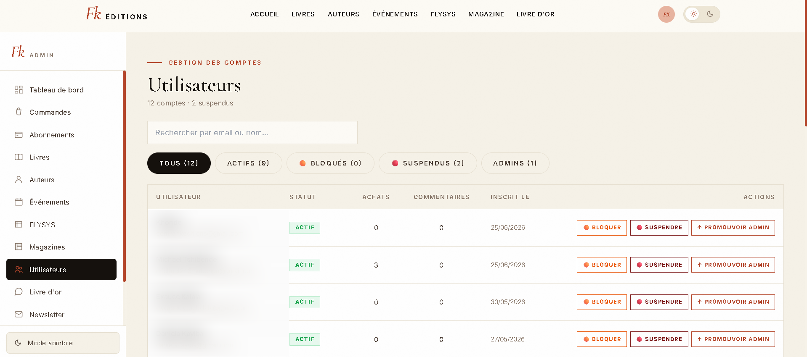

<div align="center">

# 📚 FK Éditions

**Plateforme e-commerce d'une maison d'édition indépendante** — vente de livres numériques, physiques et audio, abonnements à la plateforme d'apprentissage **FLYSYS**, et back-office d'administration complet.

Basée à Kinshasa, République Démocratique du Congo 🇨🇩

### [**🌐 Voir le site en ligne → fk-editions.com**](https://fk-editions.com)

[](https://fk-editions.com)


</div>

---

## ✨ Aperçu

FK Éditions est une application **full-stack** construite avec **Next.js (App Router)**. Elle couvre l'intégralité du parcours d'une maison d'édition moderne : catalogue en ligne, lecture d'ebooks et d'audiolivres dans le navigateur, trois moyens de paiement (dont le **Mobile Money** local), gestion des abonnements, et un panneau d'administration riche pour piloter le catalogue, les commandes et les utilisateurs.

## 🎯 Le but du site

FK Éditions répond à un objectif clair : **donner à une maison d'édition indépendante congolaise une vitrine et une boutique numériques complètes**, pour diffuser la culture, la littérature et le savoir africains bien au-delà de Kinshasa.

Concrètement, le site permet de :

- 📖 **Vendre et lire les ouvrages** de la maison — en **numérique** (PDF / ePub), en **papier** et en **audio** — directement en ligne, sans intermédiaire.
- 💳 **Rendre l'achat accessible localement** grâce au **Mobile Money** (M-Pesa, Airtel), le moyen de paiement du quotidien en RDC, en plus de la carte bancaire et de PayPal pour l'international.
- 🎓 **Former et transmettre** via **FLYSYS**, la plateforme d'apprentissage par abonnement (cours, exercices, analyses) accessible à tous et aux institutions.
- 🗞️ **Faire rayonner la marque** avec l'espace **Magazine**, les **événements**, le **livre d'or** et la **newsletter**.
- 🛠️ **Rendre l'équipe totalement autonome** : catalogue, prix, contenus, commandes et abonnements se gèrent depuis un **back-office**, sans jamais toucher au code.

> En une phrase : **une maison d'édition entièrement pilotable en ligne, pensée pour le marché congolais et ouverte sur le monde.**

## 📸 Captures d'écran

> 🖼️ Déposez vos images dans [`docs/screenshots/`](./docs/screenshots) en respectant les noms ci-dessous, elles s'afficheront automatiquement.

| Accueil | Catalogue |
|:---:|:---:|
|  |  |
| **Fiche livre** | **Lecteur audio** |
|  |  |
| **FLYSYS — Abonnements** | **Ma bibliothèque** |
|  |  |
| **Back-office — Tableau de bord** | **Back-office — Utilisateurs** |
|  |  |

<!--
  Pour remplir cette section :
  1. Crée le dossier docs/screenshots/ (déjà présent).
  2. Dépose tes captures en .png avec exactement ces noms :
       accueil.png · catalogue.png · fiche-livre.png · lecteur-audio.png
       flysys.png · bibliotheque.png · admin-dashboard.png · admin-utilisateurs.png
  3. Ajoute/retire des lignes du tableau selon le nombre de captures.
  Astuce : largeur ~1280px, format paysage, thème clair pour un rendu homogène.
-->

## 🚀 Fonctionnalités

### Côté client
- 🛒 **Catalogue** — livres numériques (PDF), physiques et **audiolivres**, avec extraits gratuits, pré-commandes et recherche par catégorie.
- 📖 **Lecture intégrée** — lecteur **PDF** et **ePub** dans le navigateur, lecteur **audio** avec reprise automatique de la progression.
- 🎓 **FLYSYS** — plateforme d'apprentissage par abonnement (formules Standard, Premium, FLYSYS X) donnant accès aux contenus exclusifs pendant 1 mois.
- 🗞️ **Espace Magazine** — éditions Premium / Gold regroupées par vedette.
- 💳 **Paiements** — **Stripe** (carte bancaire), **PayPal**, et **Mobile Money** (M-Pesa, Airtel, Orange) avec validation manuelle sous 24h.
- 👤 **Comptes** — inscription, connexion, réinitialisation de mot de passe par email, profil, avatar, et **bibliothèque personnelle** (achats + revues).
- 💬 **Livre d'or** — messages des lecteurs, modérés avant publication.
- 📬 **Newsletter** & **événements**.
- 🌗 **Thème clair / sombre**.

### Back-office (`/admin`)
- 📚 Gestion du **catalogue** (livres, magazines, auteurs, numéros de revue) avec upload de fichiers vers S3.
- 🧾 Suivi des **commandes** et validation des paiements Mobile Money.
- 🎫 Gestion des **abonnements** FLYSYS.
- 👥 **Utilisateurs** — blocage, suspension (réversible), attribution du rôle admin.
- ✅ **Modération** des avis.
- ⚙️ **Paramètres** du site (coordonnées, réseaux, numéros Mobile Money…).
- 📊 **Statistiques** de revenus & **journal d'audit** des actions admin.

## 🛠️ Stack technique

| Domaine | Technologies |
|---------|-------------|
| **Framework** | Next.js 16 (App Router, Turbopack), React 19 |
| **Langage** | TypeScript (mode `strict`) |
| **Base de données** | MySQL 8 via **Prisma ORM** |
| **Authentification** | NextAuth (Credentials + adapter Prisma), `bcryptjs` |
| **Styles** | Tailwind CSS + variables CSS (design system maison) |
| **Paiements** | Stripe, PayPal, Mobile Money (intégration maison) |
| **Stockage fichiers** | AWS S3 (`@aws-sdk/client-s3`) |
| **Emails** | Resend |
| **Lecteurs** | `react-pdf`, `epubjs` |

## 🏗️ Architecture

Le projet suit une séparation stricte des responsabilités : **routes** (App Router) ⟶ **logique métier** (`lib/services`) ⟶ **UI** (composants co-localisés et partagés).

```
fkeditions/
├── app/                        # Routes (App Router) + route handlers API
│   ├── */_components/          #   composants co-localisés propres à chaque page
│   ├── admin/                  #   back-office (catalogue, commandes, utilisateurs…)
│   ├── api/                    #   API : auth, checkout, admin, download signés…
│   ├── bibliotheque/           #   espace lecteur (achats + revues)
│   └── livres/[id]/            #   fiche livre, lecture (PDF/ePub), écoute (audio)
├── components/                 # Composants partagés, rangés par domaine
│   ├── layout/                 #   Navbar (+ hook & sous-menus), Footer, Topbar…
│   ├── auth/  checkout/  reader/  admin/  ui/  home/
├── lib/                        # Logique métier & utilitaires
│   ├── services/               #   accès données Prisma : library, books, authors
│   ├── prisma · auth · s3 · email · stripe · paypal
│   ├── constants · mobileMoney · settings · rateLimit · auditLog · signedToken
├── prisma/                     # Schéma de données + seed
├── data/                       # Données statiques de repli (fallback hors-ligne)
├── types/                      # Types globaux (augmentation NextAuth…)
└── middleware.ts               # Protection des routes
```

> 💡 **Convention** : chaque page volumineuse est découpée en composants privés dans un dossier `_components/` (le préfixe `_` l'exclut du routage Next.js), et la logique d'accès aux données vit dans `lib/services/` — jamais dans les composants d'interface.

## ⚡ Démarrage rapide

### Prérequis
- **Node.js 20+**
- **MySQL 8+**
- Comptes/API keys : Stripe, PayPal, Resend, AWS S3 (voir [variables d'environnement](#-variables-denvironnement))

### Installation

```bash
# 1. Cloner et installer les dépendances
git clone https://github.com/PuatiJosue/fkeditions.git
cd fkeditions
npm install

# 2. Configurer l'environnement
cp .env.example .env
#   → éditez .env avec vos propres valeurs

# 3. Générer le client Prisma et appliquer le schéma
npx prisma generate
npx prisma db push

# 4. Peupler la base avec les données initiales
npm run seed

# 5. Lancer en développement
npm run dev
```

- Site : <http://localhost:3000>
- Back-office : <http://localhost:3000/admin>

## 🔑 Variables d'environnement

Toutes les variables sont documentées dans [`.env.example`](./.env.example).

| Variable | Rôle |
|----------|------|
| `DATABASE_URL` | Connexion MySQL (Prisma) |
| `NEXTAUTH_SECRET`, `NEXTAUTH_URL` | Authentification NextAuth |
| `ADMIN_EMAIL` | Email du compte administrateur |
| `STRIPE_SECRET_KEY`, `NEXT_PUBLIC_STRIPE_PUBLISHABLE_KEY`, `STRIPE_WEBHOOK_SECRET` | Paiements Stripe |
| `PAYPAL_CLIENT_ID`, `PAYPAL_CLIENT_SECRET`, `PAYPAL_MODE`, `NEXT_PUBLIC_PAYPAL_CLIENT_ID` | Paiements PayPal |
| `RESEND_API_KEY` | Emails transactionnels |
| `AWS_REGION`, `AWS_ACCESS_KEY_ID`, `AWS_SECRET_ACCESS_KEY`, `S3_BUCKET` | Stockage des fichiers sur S3 |

## 📜 Scripts npm

| Script | Description |
|--------|-------------|
| `npm run dev` | Serveur de développement (Turbopack) |
| `npm run build` | Build de production |
| `npm start` | Démarre le build de production |
| `npm run lint` | Lint Next.js |
| `npm run seed` | Peuple la base de données |

## 🗃️ Modèle de données

Principaux modèles Prisma (voir [`prisma/schema.prisma`](./prisma/schema.prisma)) :

- **User** — comptes, rôles (`CUSTOMER` / `ADMIN`), blocage/suspension, sessions.
- **Book** — livres (ebook / physique / audio), magazines, pré-commandes, extrait.
- **Author** · **RevueIssue** — auteurs et numéros de la revue FLYSYS.
- **Purchase** · **Subscription** — achats et abonnements (Stripe / PayPal / Mobile Money).
- **Comment** — livre d'or (modéré). **Event**, **NewsletterSubscriber**, **Setting**.
- **LoginHistory** · **AuditLog** — traçabilité de sécurité et des actions admin.

## 🔒 Sécurité

- Mots de passe hachés avec **bcrypt**.
- **Rate limiting** sur les endpoints sensibles (`lib/rateLimit.ts`).
- **Jetons signés** pour le téléchargement des fichiers payants (`lib/signedToken.ts`).
- **Middleware** de protection des routes privées et admin.
- **Journal d'audit** et **historique de connexion** pour la traçabilité.
- Contenus payants stockés hors du dépôt (S3 / dossier privé, jamais dans Git).

## 🚢 Déploiement

L'application est un projet Next.js standard : `npm run build` puis `npm start` derrière un reverse-proxy, ou tout hébergeur compatible Node. Les fichiers média (couvertures, PDF, ePub, audios, avatars) sont servis depuis **AWS S3**.

## 👤 Auteur

Développé par **Josué Puati** · Maison d'édition **FK Éditions**, fondée par Fortune Khonde (Kinshasa, 2020).

---

<div align="center">
<sub>Fait avec ❤️ à Kinshasa</sub>
</div>
